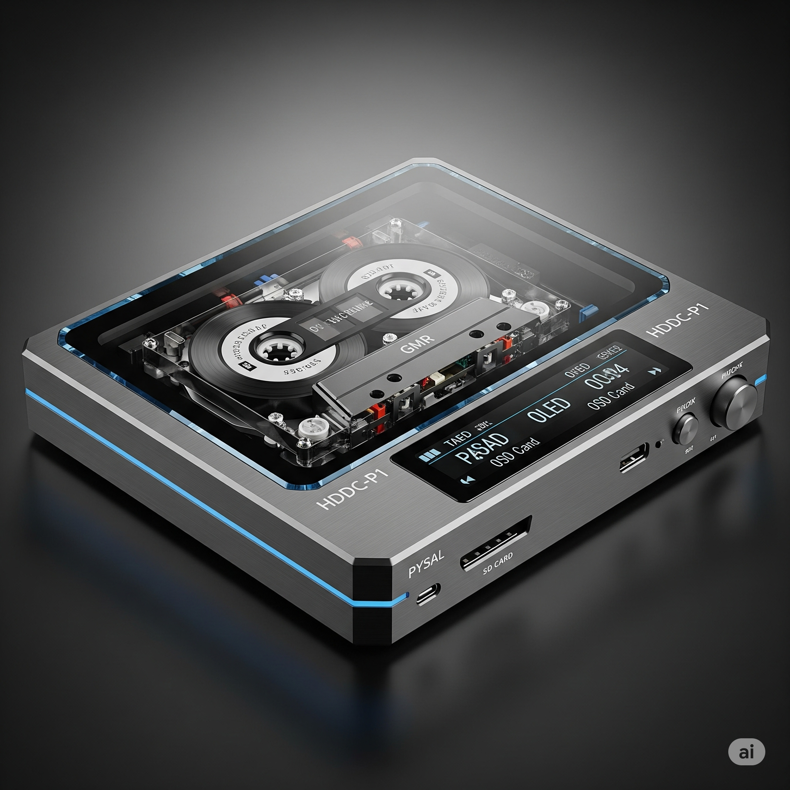

# High-Density Digital Cassette (HDDC) Project

**A thought experiment in engineering physical media storage using standard audio cassettes**

## What This Is (And Isn't)

Ideas are cheap and everyone has them - this is no different. This is a thought experiment about how to actually engineer a format specification for high-density digital storage on cassette tapes. I'm not particularly skilled in any specific area of this project, so this is more about exploring "what if we could..." rather than "here's how to build it."

This started as an over-engineered concept for fun and grew into a detailed technical specification. It's engineering fiction - plausible enough to be interesting, detailed enough to spark real discussions about feasibility.

## The Concept



The High-Density Digital Cassette (HDDC) system would theoretically transform standard audio cassette tapes into high-capacity digital storage media, achieving approximately **1GB storage capacity per 90-minute cassette** while maintaining compatibility with existing tape media.

## Key Innovations

- **PCB-Integrated Motors**: Revolutionary dual-spindle direct drive eliminates traditional capstan mechanisms
- **Intelligent Tape Health Monitoring**: Real-time stretch detection and adaptive tension control
- **Self-Aware Media**: Tapes track their own health and optimize playback automatically
- **50-80 Track Multi-Head**: GMR sensor arrays enable massive parallel data streams
- **Graceful Degradation**: RAID-6 like redundancy survives loss of up to 40% of tracks

## Technical Specifications

- **Capacity**: ~1GB per C90 cassette
- **Data Rate**: ~300KB/s sustained read/write
- **Track Count**: 50-80 parallel tracks
- **Error Correction**: Reed-Solomon + LDPC with cross-track redundancy
- **Legacy Support**: Can read original analog audio cassettes

## Repository Structure

```
hddc-project/
├── hardware/
│   ├── head-assembly/     # GMR sensor PCB designs
│   ├── main-board/        # Processor and ADC boards
│   └── mechanical/        # 3D printable parts
├── firmware/
│   ├── esp32/            # ESP32 implementation
│   ├── stm32/            # STM32 implementation
│   └── dsp/              # Signal processing libraries
├── software/
│   ├── encoder/          # PC-based tape image creator
│   └── analyzer/         # Debugging and analysis tools
└── documentation/
    ├── assembly/         # Build instructions
    └── calibration/      # Alignment procedures
```

## Development Phases

1. **Phase 1**: 8-track prototype with basic functionality
2. **Phase 2**: 32-track version with full error correction
3. **Phase 3**: 64+ track production design
4. **Phase 4**: Integrated recording capability

## Getting Started

This project is currently in the conceptual/design phase. See `digital-cassette-tech-spec.md` for the complete technical specification.

## License

This project is licensed under the Creative Commons Attribution-ShareAlike 4.0 International License with additional attribution requirements. See LICENSE for details.

## Author

**Aaron Bockelie** - Original concept and technical specification

## Contributing

Contributions welcome! Please read CONTRIBUTING.md for guidelines.

---

*"Not just better cassettes, but better media."*